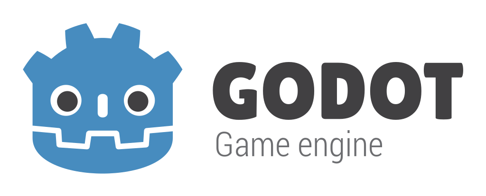

# Crosshair

Last verified: 2026-06-30

  

## 2D and 3D cross-platform game engine

**Crosshair** is a fork of [Godot Engine](https://godotengine.org): a feature-packed, cross-platform
game engine to create 2D and 3D games from a unified interface. It provides a
comprehensive set of [common tools](https://godotengine.org/features), so that
users can focus on making games without having to reinvent the wheel. Games can be
exported with one click to a number of platforms, including the major desktop
platforms (Linux, macOS, Windows), mobile platforms (Android, iOS), as well as
Web-based platforms and [consoles](https://godotengine.org/consoles).

Upstream documentation remains on [Read the Docs](https://docs.godotengine.org) and applies unless this fork documents differences.

## Free, open source and community-driven

Crosshair inherits Godot’s MIT license and third-party notices. Godot was open sourced in [February 2014](https://github.com/godotengine/godot/commit/0b806ee0fc9097fa7bda7ac0109191c9c5e0a1ac) after years of in-house development by [Juan Linietsky](https://github.com/reduz) and [Ariel Manzur](https://github.com/punto-).

## Getting the engine

### Binary downloads

Build from source (see below) or use binaries produced from this repository.

### Compiling from source

[See the official docs](https://docs.godotengine.org/en/latest/engine_details/development/compiling)
for compilation instructions for every supported platform (same process as Godot).

## Community and contributing

Upstream Godot community channels are listed [on the Godot homepage](https://godotengine.org/community).

To contribute to upstream Godot, see [CONTRIBUTING.md](CONTRIBUTING.md).

## Documentation and demos

The official Godot documentation is hosted on [Read the Docs](https://docs.godotengine.org).

The [class reference](https://docs.godotengine.org/en/latest/classes/)
is also accessible from the editor.

Official demos: [godot-demo-projects](https://github.com/godotengine/godot-demo-projects).

